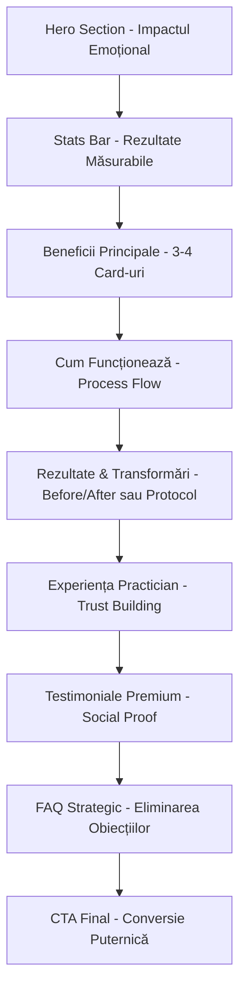

# 🎨 Design Pattern Premium & Experiențial - Pagini Servicii

## 📋 Viziune Generală

Design premium și experiențial cu focus pe **transformare**, **rezultate măsurabile** și **experiență client excelentă**. Inspirat din pagina de Nutriție Celulară, acest template creează încredere prin:

- ✅ Rezultate vizibile și măsurabile
- ✅ Povești autentice de transformare
- ✅ Expertiză și autoritate
- ✅ Call-to-action clare și convingătoare
- ✅ Design modern, premium și accesibil

---

## 🏗️ Structura Paginii (Ordinea Secțiunilor)



---

## 📐 Secțiuni Detaliate

### 1. HERO SECTION - Impactul Emoțional
**Obiectiv:** Prima impresie puternică, conexiune emoțională imediată

**Structură:**
```typescript
// Layout: Grid 2 coloane (Desktop) / Stacked (Mobile)
{
  leftColumn: {
    badge: "🌟 Terapie Premium/Recunoscută/Inovatoare",
    headline: "Titlu Puternic + Subtitle Emoțional",
    description: "2-3 propoziții despre transformarea posibilă",
    stats: "3 metrici cheie în grid (rezultate, experiență, clienți)",
    cta: ["CTA Primar: Programează", "CTA Secundar: Telefon"]
  },
  rightColumn: {
    visual: "Imagine hero mare sau Icon/Graphic reprezentativ",
    floatingCard: "Card cu beneficiu principal sau statistică"
  }
}
```

**Design Elements:**
- Gradient Background: `from-[culoare-primara] via-[culoare-secundara] to-[culoare-tertiara]`
- Text alb cu accente color pentru keywords
- Badge-uri cu background transparent + border
- Stats în grid 3 coloane cu iconițe

**Copywriting:**
- Headline: Promisiune emoțională (transformare, rezultat dorit)
- Description: Beneficiu specific + cum se realizează
- Stats: Cifre concrete care validează promisiunea

---

### 2. STATS BAR - Rezultate Măsurabile
**Obiectiv:** Validare imediată prin cifre și autoritate

**Structură:**
```typescript
{
  layout: "Grid 3-4 coloane, centrat",
  items: [
    { number: "Cifră mare", label: "Metric important", icon: "Icon relevant" },
    { number: "X%", label: "Rezultat măsurabil", icon: "Icon" },
    { number: "X+", label: "Social proof", icon: "Icon" }
  ]
}
```

**Exemple Metrici:**
- Rezultate clinice (%, creștere)
- Ani de experiență
- Număr clienți mulțumiți
- Certificate/Recunoașteri
- Timp mediu pentru rezultate

---

### 3. BENEFICII PRINCIPALE - Impact Cards
**Obiectiv:** Prezentarea beneficiilor concrete și măsurabile

**Structură:**
```typescript
{
  heading: "Transformările Tale",
  description: "Explicație scurtă despre ce va experimenta clientul",
  cards: [
    {
      icon: "IconComponent", // Lucide icons
      title: "Beneficiu Principal",
      description: "Explicație detaliată 2-3 propoziții",
      metric: "Cifră/Studiu care validează (opțional)"
    }
  ],
  layout: "Grid 2-3 coloane"
}
```

**Design Elements:**
- Cards cu hover effect (shadow increase)
- Icon circular cu background color
- Metric în badge sau text evidențiat
- Spațiere generoasă între cards

**Copywriting:**
- Titlu: Beneficiul direct, nu feature-ul tehnic
- Descriere: Cum se manifestă beneficiul în viața reală
- Validare: Cifră/studiu dacă disponibil

---

### 4. CUM FUNCȚIONEAZĂ - Process Flow
**Obiectiv:** Claritate și transparență despre proces

**Structură:**
```typescript
{
  heading: "Procesul Tău de Transformare",
  description: "Pași clari și predictibili",
  steps: [
    {
      number: "1",
      title: "Evaluare Inițială",
      description: "Ce se întâmplă în primul pas",
      duration: "Timp estimat"
    }
  ],
  layout: "Timeline orizontal sau vertical cu conectori vizuali"
}
```

**Design Elements:**
- Numere mari în cercuri colorate
- Conectori vizuali între pași (linii sau săgeți)
- Fiecare pas în card sau section distinct
- Timeline progress indicator

---

### 5. REZULTATE & TRANSFORMĂRI
**Obiectiv:** Dovezi concrete de eficiență

**Varianta A - Protocol în Faze (ca Nutriție Celulară):**
```typescript
{
  heading: "Programul Tău Personalizat",
  phases: [
    {
      phase: "Faza 1: Nume Descriptiv",
      duration: "Zilele X-Y",
      description: "Ce se întâmplă",
      elements: ["Element 1", "Element 2"],
      benefits: ["Beneficiu 1", "Beneficiu 2"]
    }
  ]
}
```

**Varianta B - Before/After/Results:**
```typescript
{
  heading: "Rezultate Măsurabile",
  metrics: [
    { label: "Metric", before: "Valoare inițială", after: "Valoare finală", improvement: "% îmbunătățire" }
  ]
}
```

**Design Elements:**
- Cards cu gradient subtle
- Progress indicators vizuale
- Grid layout cu spațiere clară
- Color coding pentru fiecare fază/rezultat

---

### 6. EXPERIENȚA PRACTICIAN - Trust Building
**Obiectiv:** Autoritate, expertiză, încredere

**Structură:**
```typescript
{
  layout: "Grid 2 coloane: Image + Content",
  content: {
    badge: "🎯 Expertiză Certificată",
    heading: "Abordarea Noastră Unică",
    steps: [
      {
        number: "1",
        title: "Pas procesului",
        description: "Detalii"
      }
    ],
    highlight: "Box special cu unique value proposition"
  },
  image: "Foto practician sau proces"
}
```

**Copywriting:**
- Focus pe metodologie unică
- Certificări și pregătire
- De ce diferit față de alții
- Engagement personal și dedication

---

### 7. TESTIMONIALE PREMIUM - Social Proof
**Obiectiv:** Validare prin experiențe reale

**Structură:**
```typescript
{
  heading: "Transformări Reale",
  description: "Povești autentice ale clienților",
  testimonials: [
    {
      text: "Poveste completă de transformare (3-4 propoziții)",
      name: "Nume Client",
      title: "Profesie/Vârstă/Context",
      condition: "Problemă rezolvată",
      rating: 5,
      image: "Avatar opțional"
    }
  ],
  layout: "Grid 3 coloane sau Carousel"
}
```

**Design Elements:**
- Stars pentru rating
- Quote marks vizuale
- Cards cu border/shadow
- Client info bine formatată

**Copywriting:**
- Testimonial complet: Problemă → Soluție → Rezultat
- Date specifice când posibil (timp, rezultate)
- Emoție autentică în relatare

---

### 8. FAQ STRATEGIC - Eliminarea Obiecțiilor
**Obiectiv:** Răspunsuri la întrebări care blochează conversiile

**Structură:**
```typescript
{
  heading: "Întrebări Frecvente",
  description: "Tot ce trebuie să știi",
  faqs: [
    {
      question: "Întrebare specifică și clară",
      answer: "Răspuns complet și onest care elimină obiecția"
    }
  ],
  layout: "Cards sau Accordion"
}
```

**Întrebări Esențiale:**
1. "Cum funcționează exact?"
2. "Cât timp durează să văd rezultate?"
3. "Este sigur/potrivit pentru mine?"
4. "Cât costă și ce include?"
5. "Ce diferențiază această terapie?"
6. "Ce studii/dovezi există?"

---

### 9. CTA FINAL - Conversie Puternică
**Obiectiv:** Acțiune clară și imediat

**Structură:**
```typescript
{
  background: "Gradient similar hero",
  content: {
    heading: "Heading puternic cu urgență soft",
    description: "Reiterarea beneficiului principal + eliminarea riscului",
    cta: [
      { primary: "Programează Consultația", style: "bg-white text-primary" },
      { secondary: "WhatsApp Direct", style: "outline white" }
    ],
    reassurance: "Trust signals: ✨ Consultație gratuită • 📞 Răspuns în 2h"
  }
}
```

**Copywriting:**
- Headline: Invitație la transformare (nu presiune)
- Description: Ce primește + eliminare risc
- Trust signals: Garanții soft, suport disponibil

---

## 🎨 Design System - Elemente Vizuale

### Culori pentru Servicii
```typescript
const serviceColors = {
  "terapie-bowen": {
    primary: "green-600",
    secondary: "emerald-600", 
    accent: "green-200",
    gradient: "from-green-600 to-emerald-600"
  },
  "biorezonanta": {
    primary: "purple-600",
    secondary: "violet-600",
    accent: "purple-200", 
    gradient: "from-purple-600 to-violet-600"
  },
  "healy": {
    primary: "yellow-500",
    secondary: "orange-500",
    accent: "yellow-200",
    gradient: "from-yellow-500 to-orange-500"
  },
  "apa-kangen": {
    primary: "blue-600",
    secondary: "cyan-600",
    accent: "blue-200",
    gradient: "from-blue-600 via-cyan-600 to-teal-600"
  },
  "andullation": {
    primary: "blue-600",
    secondary: "cyan-600",
    accent: "cyan-200",
    gradient: "from-blue-600 via-cyan-600 to-teal-600"
  },
  "nutritie-celulara": {
    primary: "violet-600",
    secondary: "purple-600",
    accent: "violet-200",
    gradient: "from-violet-600 via-purple-600 to-violet-800"
  }
}
```

### Spacing & Typography
```css
/* Spacing Scale */
section-padding: py-20 /* 5rem top/bottom */
container-max: max-w-7xl mx-auto px-4 sm:px-6 lg:px-8
card-padding: p-6 md:p-8
gap-cards: gap-8
gap-sections: space-y-8

/* Typography Scale */
h1: text-4xl md:text-5xl lg:text-6xl font-bold
h2: text-3xl md:text-4xl font-bold  
h3: text-xl md:text-2xl font-semibold
body: text-base md:text-lg
small: text-sm
```

### Components Patterns
```typescript
// Card Premium
<Card className="hover:shadow-xl transition-all duration-300 border-0">
  <CardContent className="p-8">
    {/* Content */}
  </CardContent>
</Card>

// Badge
<Badge variant="outline" className="bg-white/20 text-white border-white/30">
  🌟 Text
</Badge>

// Button Primary
<Button size="lg" className="bg-white text-[primary] hover:bg-gray-100 px-8 py-4">

// Button Secondary  
<Button size="lg" variant="outline" className="border-white text-white hover:bg-white/10">

// Icon Container
<div className="w-16 h-16 bg-[color]-100 rounded-full flex items-center justify-center">
  <Icon className="text-[color]-600" />
</div>
```

---

## 📝 Content Guidelines

### Tone of Voice
- **Premium dar Accesibil:** Profesional fără a fi steril
- **Empatic și Asigurător:** Înțelegem provocările clientului
- **Optimist și Motivant:** Focus pe transformare, nu pe problemă
- **Onest și Transparent:** Fără claim-uri nesigure sau exagerate

### Copywriting Formule

**PAS (Problem-Agitate-Solve):**
```
1. Identifică problema (empatie)
2. Adâncește (ce înseamnă pentru client)
3. Prezintă soluția (terapia)
```

**Features → Benefits:**
```
❌ "Folosim frecvențe de 5-40Hz"
✅ "Relaxare profundă prin stimulare delicată care activează procesele naturale de vindecare"
```

**Before/After/Bridge:**
```
1. Unde ești acum (problema)
2. Unde vrei să fii (visia)
3. Cum te ducem acolo (soluția)
```

### Keywords Integration
- Integrare naturală în copy (nu keyword stuffing)
- Focus pe intent-ul utilizatorului
- Variații long-tail pentru FAQ

---

## 🚀 Conversion Optimization

### Trust Signals Hierarchy
1. **Certificări/Aprobări** (Hero section)
2. **Cifre/Studii** (Stats bar)
3. **Process Transparency** (Cum funcționează)
4. **Testimoniale** (Social proof)
5. **FAQ onest** (Elimină obiecții)
6. **Garanții soft** (CTA final)

### CTA Strategy
- **Hero:** Acțiune primară (Programează)
- **Mid-page:** Soft CTA (Află mai multe, WhatsApp)
- **Footer:** Strong CTA (Programează + telefon)
- **Mobile:** Sticky WhatsApp button

### Mobile-First Considerations
```typescript
// Responsive Grid
grid-cols-1 md:grid-cols-2 lg:grid-cols-3

// Stack Priority
- Hero: Image after text pe mobile
- Stats: 2 columns max pe mobile  
- Cards: Single column pe mobile
- CTA: Full width buttons pe mobile
```

---

## 🎯 Implementare - Checklist

Pentru fiecare serviciu:

### Content
- [ ] Headline puternic și emoțional
- [ ] 3-4 beneficii concrete și măsurabile
- [ ] Process în 3-5 pași clari
- [ ] Minimum 3 testimoniale autentice
- [ ] 6-8 FAQ strategice
- [ ] 2 CTA-uri principale (Programează + WhatsApp)

### Design
- [ ] Hero cu gradient specific serviciului
- [ ] Stats bar cu cifre reale
- [ ] Icons consistente (Lucide)
- [ ] Cards cu hover effects
- [ ] Responsive pe toate device-urile
- [ ] Loading states pentru imagini

### SEO & Performance
- [ ] Meta title optimizat (60 chars)
- [ ] Meta description convingătoare (155 chars)
- [ ] H1-H6 ierarhie corectă
- [ ] Alt text pentru imagini
- [ ] Schema markup (Service, FAQ)
- [ ] Lazy loading imagini

### Analytics
- [ ] Track CTA clicks
- [ ] Track scroll depth
- [ ] Track time on page
- [ ] Track WhatsApp/Phone clicks

---

## 🔄 Template Reutilizabil

### Componente de Creat

1. **`ServiceHero.tsx`**
   - Props: title, description, stats, image, gradient, ctaText
   
2. **`BenefitCards.tsx`**
   - Props: benefits array, columns, color

3. **`ProcessTimeline.tsx`**
   - Props: steps array, orientation (horizontal/vertical)

4. **`TestimonialGrid.tsx`**
   - Props: testimonials array, layout (grid/carousel)

5. **`ServiceFAQ.tsx`**
   - Props: faqs array, layout (cards/accordion)

6. **`ServiceCTA.tsx`**
   - Props: heading, description, gradient, ctaButtons

---

## 📊 Success Metrics

### Engagement
- Time on page: Target 3-5 min
- Scroll depth: Target 75%+
- Bounce rate: Target <40%

### Conversion
- CTA click rate: Target 15%+
- Phone/WhatsApp clicks: Track separately
- Consultation bookings: Primary metric

### Content
- FAQ expansion rate
- Testimonial interaction
- Benefits section engagement

---

## 🎨 Visual Examples

### Hero Section Mockup
```
┌─────────────────────────────────────────────────────┐
│  [Gradient Background - Culoare Serviciu]           │
│                                                     │
│  🌟 Badge Text                                      │
│                                                     │
│  Headline Mare și                    [Hero Image]  │
│  Puternic                            [sau Graphic] │
│  Subtitle emoțional                                │
│                                                     │
│  Description 2-3 propoziții despre                 │
│  transformarea posibilă                            │
│                                                     │
│  ┌────┬────┬────┐                                  │
│  │ N  │ N  │ N  │ Stats Grid                       │
│  │Txt │Txt │Txt │                                  │
│  └────┴────┴────┘                                  │
│                                                     │
│  [Btn Primary]  [Btn Secondary]                    │
│                                                     │
└─────────────────────────────────────────────────────┘
```

### Benefit Cards Layout
```
┌──────────┐  ┌──────────┐  ┌──────────┐
│   [Icon] │  │   [Icon] │  │   [Icon] │
│          │  │          │  │          │
│  Title   │  │  Title   │  │  Title   │
│          │  │          │  │          │
│  Desc... │  │  Desc... │  │  Desc... │
│          │  │          │  │          │
│  Metric  │  │  Metric  │  │  Metric  │
└──────────┘  └──────────┘  └──────────┘
```

---

## 📋 Next Steps

1. **Primim link-urile oficiale** pentru extragerea informațiilor
2. **Extragem conținut** verificabil pentru fiecare serviciu
3. **Creăm componentele** reutilizabile
4. **Implementăm** prima pagină ca proof of concept
5. **Optimizăm** bazat pe feedback
6. **Replicăm** pentru restul serviciilor

---

**Status:** ✅ Design Pattern Definit - Așteptăm link-uri oficiale pentru conținut